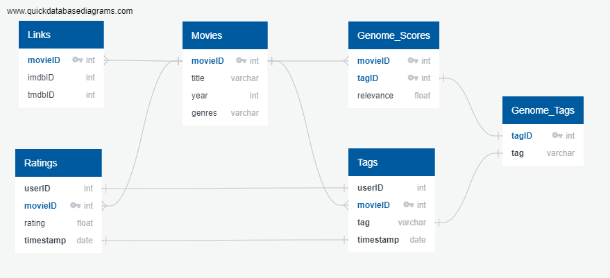

# Group 3 Final Project

<!-- PROJECT LOGO -->
 

  

  <h3 align="center">Best-README-Template</h3>

  

    Movie Recommendation ML Model
     
    <a href="https://github.com/ByronKrauskopf/Group_3_Final_Project"><strong>Explore the docs »</strong></a>
     
     
    <a href="#">View Demo</a>
    ·
    <a href="https://github.com/ByronKrauskopf/Group_3_Final_Project/issues">Report Bug</a>
    ·
    <a href="https://github.com/ByronKrauskopf/Group_3_Final_Project/issues">Request Feature</a>
  

<!--################TABLE OF CONTENTS################-->

  
Table of Contents

  <ol>
    <li>
      <a href="#about-the-project">About The Project</a>
      <ul>
        <li><a href="#built-with">Built With</a></li>
      </ul>
    </li>
    <li>
      <a href="#getting-started">Getting Started</a>
      <ul>
        <li><a href="#prerequisites">Prerequisites</a></li>
        <li><a href="#installation">Installation</a></li>
      </ul>
    </li>
    <li><a href="#usage">Usage</a></li>
    <li><a href="#roadmap">Roadmap</a></li>
    <li><a href="#contributing">Contributing</a></li>
    <li><a href="#license">License</a></li>
    <li><a href="#contact">Contact</a></li>
    <li><a href="#acknowledgments">Acknowledgments</a></li>
  </ol>

<!--################About################-->
# Project Overview
Movie Recommendation system from MovieLens dataset

Welcome to our final data analytics project. This project aims to tell a cohesive story using a dataset. As a small team, we will create an impressive data visualization app, that will be a cumulative display of the skills we acquired throughout the bootcamp. 
Our chosen project will be to build a movie recommendation system. With many streaming services available nowadays, building an efficient movie recommendation system has become more important due to the increase in demand to create customized content for consumers. We will be using the Movielens dataset to build a movie recommender system. It contains approximately 1,000,209 movie ratings of 3,900 movies made by 6,040 Movielens users.  The reason we chose this topic is because we have a large dataset to work with and we all enjoy watching movies, and are looking for a recommendation on what to watch next. The main questions we want to answer with the dataset is: 

-Can we accurately predict movie suggestions for users based off their previous ratings? 
-What factors influence users movie preferences? 

### Built With:
- AWS
- Postgres SQL + PgAdmin
- techology to be used
- ML Model and why
- Database type selected and why
- Tableau

(<a href="#top">back to top</a>)

<!--#############Getting Started################-->
# Getting Started

### Prerequisites
- installation packages and software versions

### Relational Database Setup
Using a database connected with AWS is a convienent way to store diffrent datasets that have relationships with each other.

Additional instructions to set up a PostgreSQL database instance with Amazon Web Services (AWS) can be found in this [link](https://docs.aws.amazon.com/AmazonRDS/latest/UserGuide/CHAP_GettingStarted.CreatingConnecting.PostgreSQL.html).

*Initial AWS DB setup instructions:*
1. Create and sign into your AWS Management console and open the Amazon RDS Console at https://console.aws.amazon.com/rds/.
2. In the upper-right corner of the AWS Managment Console, Choose the AWS Region where you will create the DB Instance. 
3. In the Navigation pane, choose **Databases**.
5. Choose **Create Databases.** and select the **Easy create** option.
6. On the **Create database** page, shown following, make sure that the **Standard create** option is chosen, and then choose **PostgreSQL**.
7. Under **Version**, click on the dropdown menue and select PostgreSQL 12.8-R1. This allows us to select the free tier for DB template.
9. For **Templates**, select **Free tier**.
10. Enter a name for the **DB instance identifier**.
11. For **Master username**, enter a name for the master user or leave it to the default name,
12. For **Master password**, enter a password or use an auto generated password by clicking the checkbox, **Auto generate a password**
13. Under the **Connectivity** section, click the **Additional connectivity configuration** drop down to display more options. Under **Publicly accessible** options, select **Yes**.
14. Scroll to the bottom and seelct **Create database** button. On the main AWS RDS dashboard, you should see your newly created database. It will take some time to be initialized and created. 

*Connecting the DB with pgAdmin:*
1. Navigate to the **Services** drop down tab and select **RDS**.
2. Under the **Resources** section, select **DB Instances** link.
3. Click the DB instance.
4. Copy the **Endpoint** under the **Connectivity & Security** section. This endpoint will be used to connect your pgAdmin to the AWS server. 
5. Navigate to pgAdmin and login.
6. Select **Add New Server** link. On the generated popup, enter a **Name** for the server name.
7. Cick on the **Connection** tab and in the **Host name/address** box, paste in the copied endpoint.  
8. **Port** number should be defaulted at 5432, postgres should be the defaulted **Maintenance database** unless you choose a diffrent username during the creation of the AWS DB.  
9. Fill out the **Password** that you used to create the AWS databse. 
10. Click the blue **Save** button. You should have now sucessfully connected your AWS server to your pgAdmin. 

### ERD Database Diagram

(<a href="#top">back to top</a>)

<!--################Usage################-->

# Usage
- describe use case of our project

(<a href="#top">back to top</a>)

<!--################Roadmap################-->

# Roadmap

The roadmap outlines the task's objectives, and expectations are introduced in a timetable structure utilizing an undertaking guide. Thus, the venture guide can be utilized to oversee partner assumptions and convey plans and direction assets.

Follow our roadmap below to implement our project according to the deliverables, named as segments from 1 to 4.

(<a href="#top">back to top</a>)

<!--################Communication Protocol################-->

# Communications Protocol

General communication:
For this project all communications will be done via Slack for messaging, and Zoom for meetings. Team members should check Slack at least once per day for any critical messages. 

Meetings:
Team meetings will occur 3 times a week on Tuesdays and Thursdays during class hours, and Saturday afternoons. Additional meetings can be scheduled through Slack as needed. 

Pull Requests:
When submitting a pull request in GitHub, the user should also post a notice in Slack so that all other team members are aware of the outstanding request in GitHub and can review and approve. All pull requests will require a minimum of 3 reviews and approvals from team members before merging.

(<a href="#top">back to top</a>)

<!--################Contributors################-->

# Contributing

</a>

- Douglas Oliveira
- Omar Zu'bi
- Jathuson Jayakumar
- Danni Yang
- Byron Krauskopf

(<a href="#top">back to top</a>)

